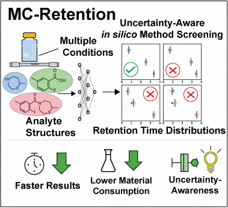

# MC-Retention
Repository for multiple condition retention time modeling (MC-Retention) and multiple condition adjusted retention times (MCaRTs) dataset.
<p align="center">


  
This repository exists to support our manuscript "Uncertainty-Aware Learning of Multiple Conditions as a Framework for Streamlined Retention Time Prediction to Accelerate Method Development", providing the code needed to generate MC-Retention models in addition to pre-trained model weights resulting from our studies.  Additionally, we hope that the community will find utility in the MCaRTs dataset.

All training scripts are intended to be run from the root directory, i.e.:`python train_scripts/480_uncert.py --model output/SMRT/SMRT_model_weight.pth`.  Logs, results, and MC-Retention models can be found in the `output/` folder.  Uncertainty quantifications are present in the root directory as `aleatoric_all.npy` and `epistemic_all.npy`.

# MCaRTs

The MCaRTs dataset (`MCaRTs.csv`) provides the adjusted retention times for analytes across eight unique chromatography conditions. These conditions are a combination of four column chemistries (C18, Cyano, Phenyl, & Gold aQ) and two buffers (0.1% v/v TFA & 10 mM NH<sub>4</sub>OAc).

All analytes were purchased from Enamine Ltd., and were screened using a five minute linear gradient of 5-85% ACN, a flow rate of 0.40 mL/min, and column temperature of 40 °C.

The unadjusted retention times are present in the file `enamine_480.csv`.

# Dependencies

The primary dependencies are:

    - PyTorch
    - Deep Graph Library (DGL)
    - RDKit
    - scikit-learn

All major dependencies besides cuda are captured in the `requirements.txt` file for CentOS Linux.
Using Anaconda, the following commands will create a new enviorment and install the needed dependencies:

```
conda create -n MC-Retention python=3.6
conda activate MC-Retention
pip install -r requirements.txt --ignore-installed certifi
conda install cudatoolkit==11.3.1
```

# Contact

For help regarding MC-Retention, please contact the corresponding authors: Armen Beck and Pankaj Aggerwal.